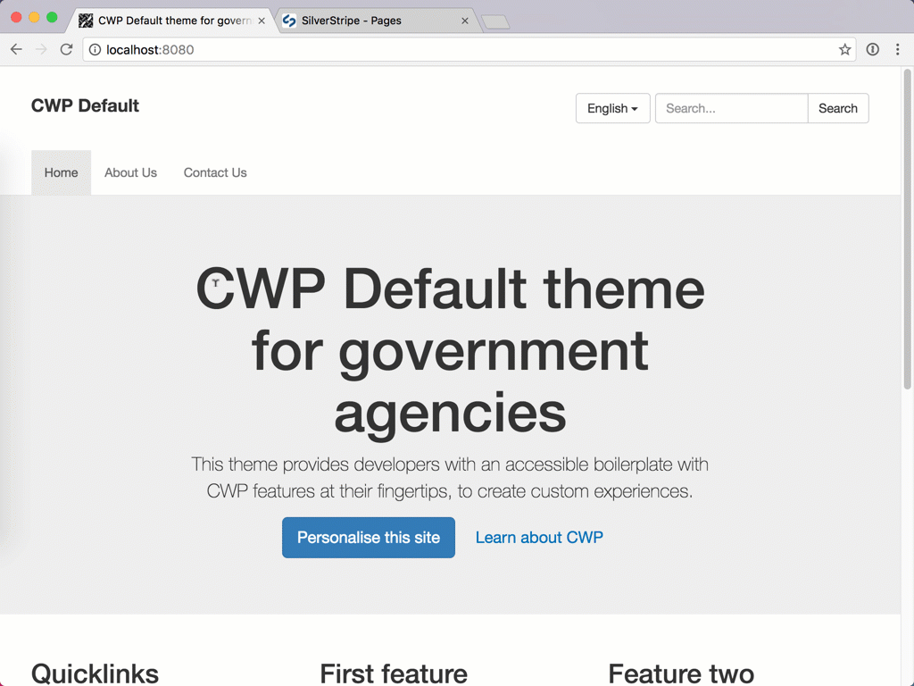
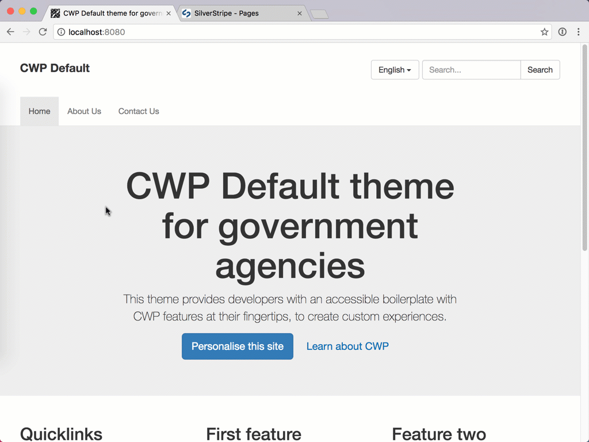

# Changing menus

The new theme comes pre-configured with a number of navigational menu components, common in most sites. These include a header (or main) menu, side menus, and a footer menu.

The header menu functions as you'd expect from a SilverStripe site. Pages in the top level of the Site Tree will be displayed in the header menu. You can show/hide links, just as you could with the previous theme:

The footer works slightly differently, displaying links added to a Footer Holder page type:

Different sections have their own side menus; like news and events. These are configured differently for each section, but the template code is easy to change. In fact, that's the point of this new theme. Dive into the `templates` folder; and change `Includes/Header.ss`, `Includes/Footer.ss`, or any of the menu includes.
