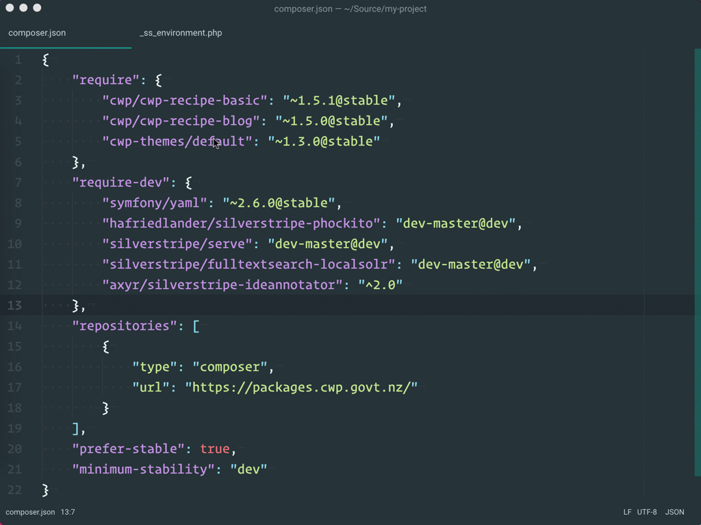

## Creating A CWP Site

We've designed the new theme to be easy to install, use, and modify. It's our hope that the starting point, for all theme development, becomes this new theme. It's built using modern standards, to be accessible, and with high-quality code.

Let's begin, by creating a new `cwp-installer` application:


> Make sure you're running a modern version of PHP. Though not a requirement for using SilverStripe, it's best to use a version that is still supported and receiving security updates. Any `^5.6` version is good. The CWP recipe installs SilverStripe `3.5`. SilverStripe `4.0` is the first version to support PHP `^7.0`, so stick with PHP `^5.6` for now.

Remember to add the CWP repository source, when creating the new project:

```
composer create-project cwp/cwp-installer my-project ↵
    --repository-url="https://packages.cwp.govt.nz"
```

In the example, I removed `cwp/cwp-recipe-basic-dev`, and added:

```js
"symfony/yaml": "^2.6@stable",
"hafriedlander/silverstripe-phockito": "dev-master@dev",
"silverstripe/serve": "dev-master@dev",
"silverstripe/fulltextsearch-localsolr": "dev-master@dev"
```

That's because `cwp/cwp-recipe-basic-dev` defines some outdated dependencies, which prevent tools like `silverstripe/serve` from being installed. The only dependencies CWP requires are `symfony/yaml`, and `hafriedlander/silverstripe-phockito`, and then only for testing purposes.

> Adding `silverstripe/serve` enables the PHP development server, which means we can avoid editing our hosts file, and setting up a virtual host. Adding `silverstripe/fulltextsearch-localsolr` enables a local [Solr](http://lucene.apache.org/solr) instance, with which we can test site search. We'll use both of these, as we learn more about the new theme.

The last step, to a new CWP site, is to create an `_ss_environment.php` file. This is an alternative to defining configuration in `mysite/_config.php` or `mysite/_config/*.yml`. It's preferable for a few reasons: like the fact that it is ignored by default, and that it can be inherited from a parent directory.

The example configuration file even shows how to point SilverStripe to a custom MySQL socket path. If you're looking for how to define other settings, check out the [official SilverStripe documentation](https://docs.silverstripe.org/en/3/getting_started/environment_management).

## Installing The New Theme

The new theme is just a Composer library - it can be installed the same as any other SilverStripe theme:



> We're still wrapping up theme development, so in this example we're using `dev-master`. That's where the latest work is being done to the theme, but you'd probably prefer to use a stable tag. So do that!

Feel free to remove the previous theme - its files aren't needed to use the new theme. The new theme includes an underlying module (which cleans the CMS a bit). Once it's installed, run `/dev/build?flush=1`. You should now see the new theme.

The code, for those repositories, is:

```js
"repositories": [
    {
        "type": "composer",
        "url": "https://packages.cwp.govt.nz/"
    },
    {
        "type": "vcs",
        "url": "https://gitlab.cwp.govt.nz/cwp/ ↵
            cwp-theme-module.git"
    },
    {
        "type": "vcs",
        "url": "https://gitlab.cwp.govt.nz/cwp/ ↵
            new-theme.git"
    }
],
```

That's it! You've got the new theme, running on a new CWP site. Time to make it yours...
