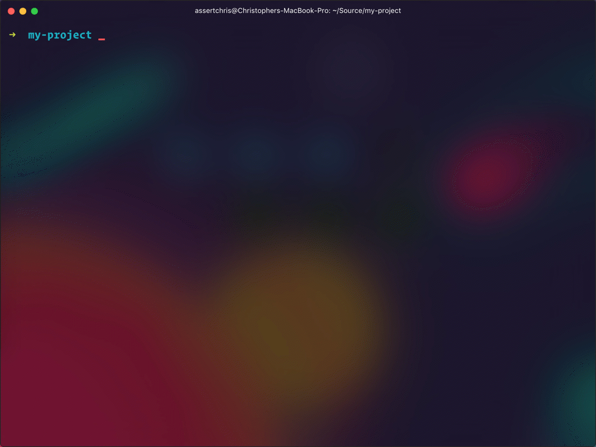
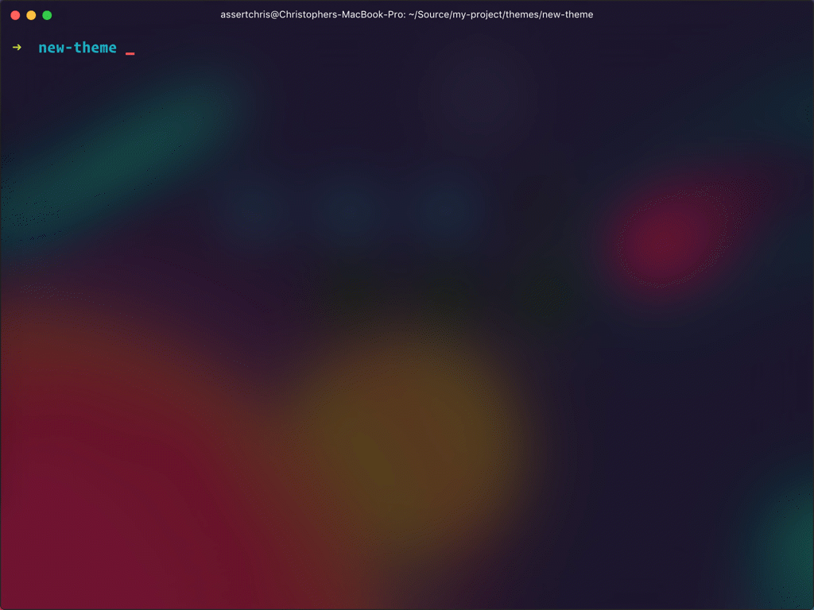

## Customising Front-End Assets

We've added very little CSS and JS to the core Bootstrap 3 feature set, but that which we have added is neatly packaged in the theme folder. The files are built using a build chain abstraction, called [Laravel Mix](https://laravel.com/docs/5.4/mix). It uses [Webpack](https://webpack.github.io) to convert, combine, minify, and improve the quality of CSS and JS files.

> You'll need to have a recent versions of Node and NPM for this build chain to work well. We've been using `v7.x` during development, so it would be best for you to use this version as well. You can check which version you have by running `node -v`.

It all begins with installing the NPM dependencies:



With these installed, you can run a few new commands. The one I show here takes various SASS and JS files and combines them into single, optimised files. You can see how this works by taking a look at what the `webpack.mix.js` file is doing:

```js
let mix = require("laravel-mix").mix;

mix.setPublicPath("dist");

mix.js("src/js/main.js", "dist/js/main.js");
mix.sass("src/scss/main.scss", "dist/css/main.css");

mix.copy("node_modules/bootstrap-sass/assets/↵
  fonts/bootstrap", "dist/fonts");
mix.copy("node_modules/font-awesome/fonts", "dist/fonts");
```

> The actual `webpack.mix.js` file may be slightly different, given improvements and slight changes made between us writing this and you reading it. The basics are all the same.

The files you need to worry about are those in the `src` directory. There you'll find a folder for SASS files, and a folder for JS files. Inside these you'll see `main.scss` and `main.js` respectively. These are the entry-points for all SASS and JS in the theme.

As you expand the code in your site, you'll want to add references to additional files, to these main files. For SASS, you can use an approach similar to how we import the components:

```css
@import "_typography";
@import "components/_skip-links";
@import "components/_footer";
@import "components/_header";
```

For JS, you can use an approach similar to how we import jQuery:

```js
import $ from 'jquery';
```

Building the bundled files can be slow, especially as you add much more code. Instead, consider running the file watcher (in a background tab), so that the bundles can be partially rebuilt, as needed. This will increase your productivity immensely:



When you start the watcher script, it will do a full build. Following that, any changes you make to a SASS or JS file triggers a partial rebuilt of the affected bundle. It can be 5x - 6x faster than doing a full build every time. And it happens automatically, so you don't forget to rebuild.

When you're about to release a new version of your app, it's a good idea to do a production build of the bundle files. Production builds are much smaller, because they exclude comments and source maps. They also minify files as much as possible.

To make a production build, run `npm run package`. If you have any questions about how to customise Laravel Mix, take a look at the [official documentation](https://github.com/JeffreyWay/laravel-mix/tree/master/docs).
