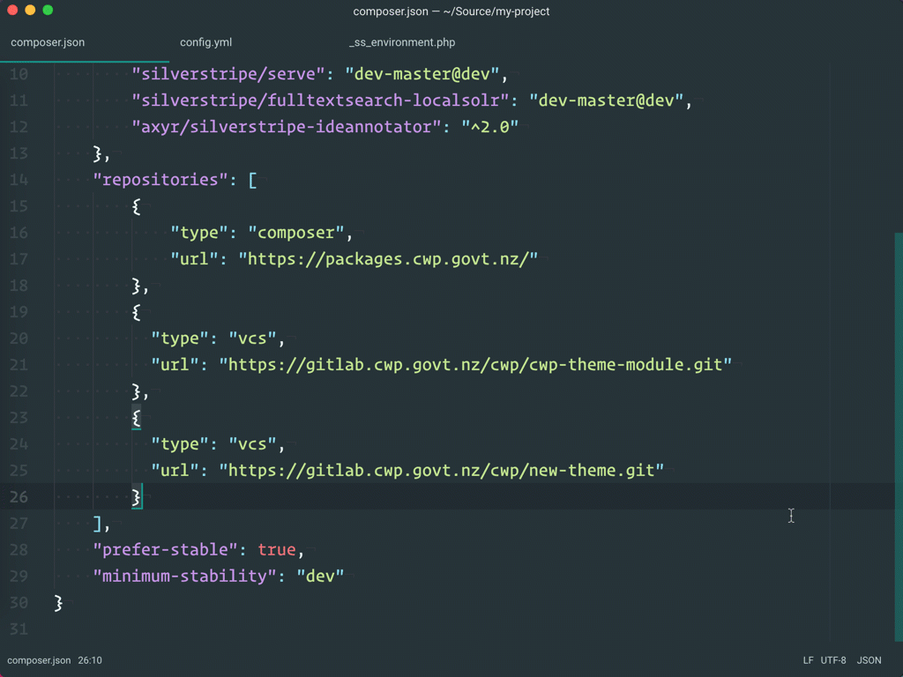

# Modifying template files

The new theme is built with the same [template syntax SilverStripe developers are used to](https://docs.silverstripe.org/en/3/developer_guides/templates). Here's what we've changed from the the existing default theme:

* Using [Bootstrap 3](http://getbootstrap.com) HTML and CSS, instead of Bootstrap 2
* Using a new, simplified build chain ([Laravel Mix](https://laravel.com/docs/5.4/mix))
* Performed a full accessibility review (with external assessors)
* Added translatable strings for all hard-coded template text
* Removed/renamed a few SiteConfig fields

Given these changes, all you need to do to modify the theme is dive into the template files:

When you make changes to a template, be sure to flush the site cache (by appending `flush=1` to the query string.
